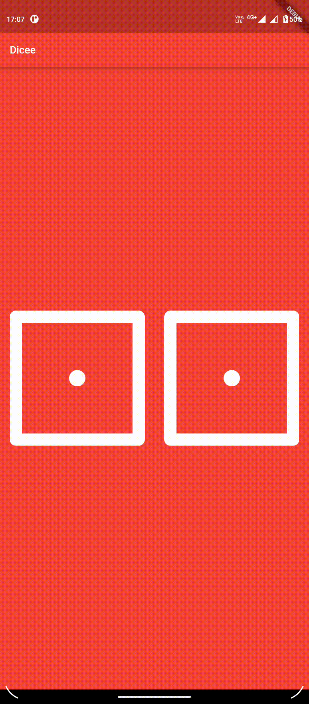

# Dicee App

This app is a Dice App. Tapping on any of the dice generates a random number on both the dice. 

## Concepts Learnt:

- Stateful Widget
- `Random()` Function in `dart:math`.

## Resultant App:

